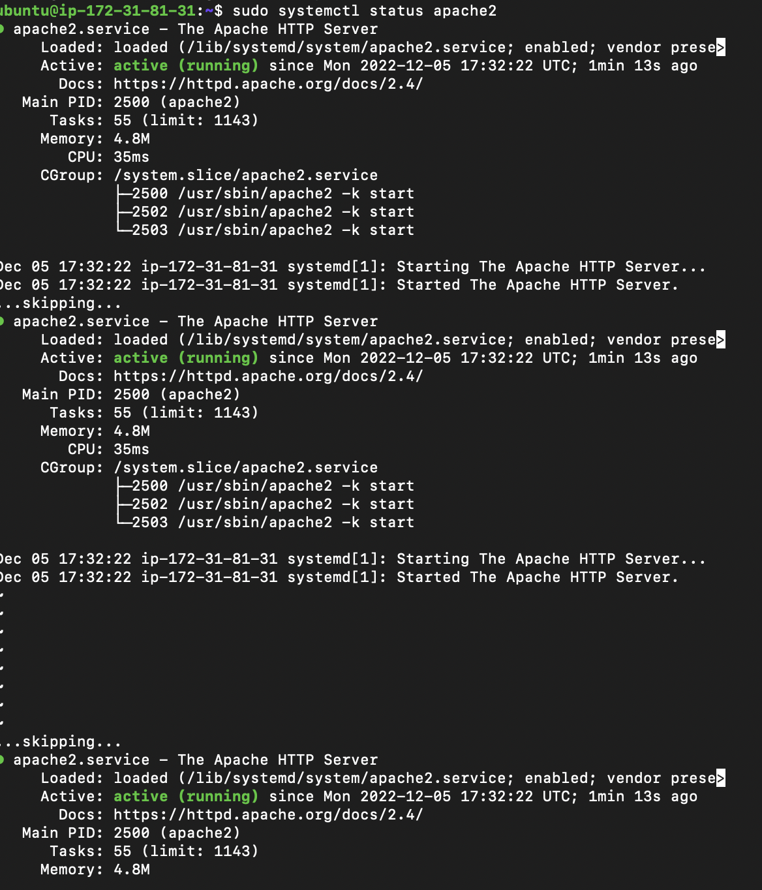
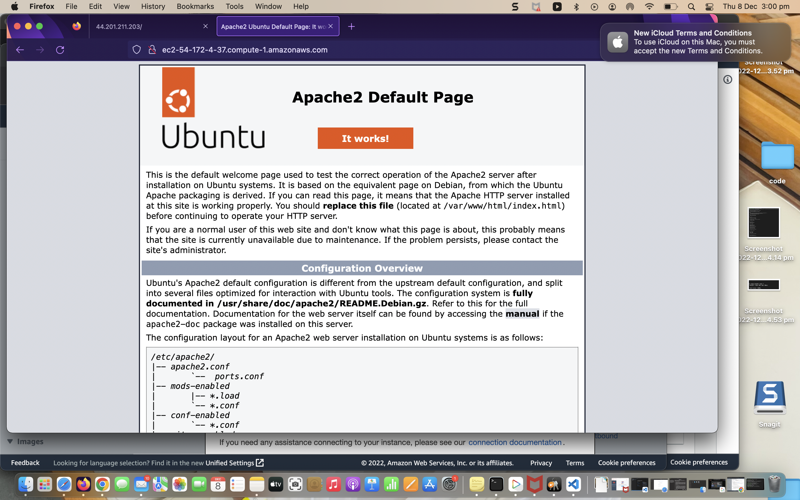
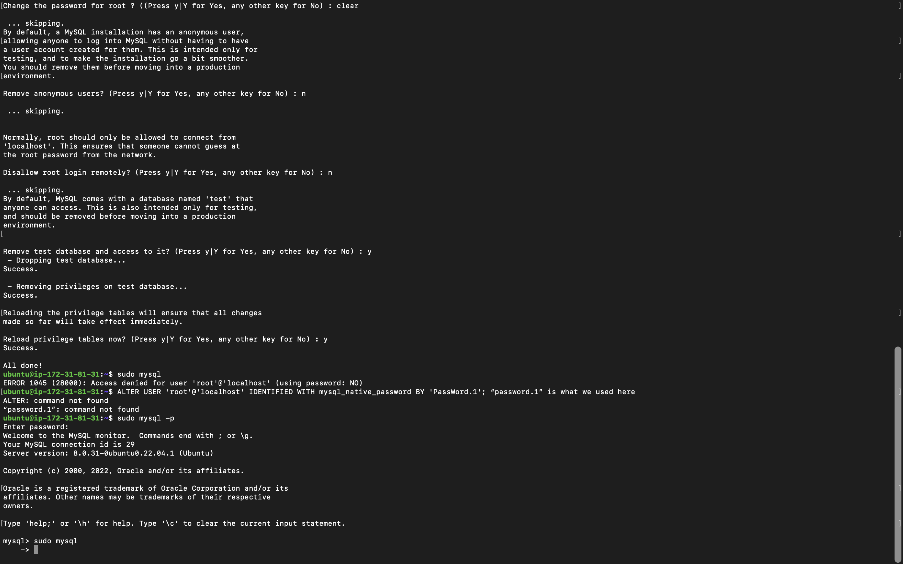

## Documentation of project1

`sudo apt update`

`sudo apt install apache2`

`sudo systemctl status apache2`

`testing the apache2` 

`sudo apt install mysql-server`

`ALTER USER 'root'@'localhost' IDENTIFIED WITH mysql_native_password BY 'PassWord.1';`

`mysql> exit`

`sudo mysql_secure_installation`

`mysql> exit`

`sudo apt install php libapache2-mod-php php-mysql`

`sudo mkdir /var/www/projectlamp`

`sudo chown -R $USER:$USER /var/www/projectlamp`

`sudo vi /etc/apache2/sites-available/projectlamp.conf`

`sudo ls /etc/apache2/sites-available`

`sudo a2ensite projectlamp`

`sudo apache2ctl configtest`

`sudo systemctl reload apache2`

`sudo vim /etc/apache2/mods-enabled/dir.conf`

`sudo systemctl reload apache2`

